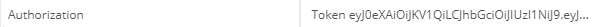
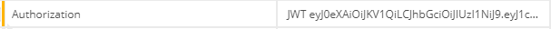

# Django
## 简介
Django是一个开源的Web应用框架 , 采用MVC的框架模式 , 即模型M , 视图V和控制器C.
MVC模型核心思想是解耦
- M表示model , 主要用于对数据库的封装
- V表示view , 用于向用户展示视图
- C表示control , 是核心 , 用于处理请求 , 获取数据 , 返回结果
- 
MTV(django实际使用的模型)
- M表示model , 负责和数据库交互(ORM)
- T表示template(模板) , 负责呈现内容到浏览器(模板语法)
- V表示view , 是核心 , 负责处理请求 , 获取数据 , 返回结果(逻辑)

### 虚拟环境
虚拟环境的主要是用来安装不同版本的框架用来运行不同的项目
- virtualenv模块  虚拟环境模块
virtualenvwrapper-win模块  虚拟环境管理包
- 相应命令
  - mkvirtualenv  name      创建虚拟环境
  - deactivate  退出虚拟环境
  - workon  name   进入虚拟环境(不加name , 显示所有虚拟环境)
  - rmvirtualenv name  删除虚拟环境
- 创建的虚拟环境会装在C:\Users\zj320\Envs目录下

## Django结构
- 创建项目
  django-admin startproject test
- manage.py 
通过其来管理django项目
  - 创建app
    python manage.py startapp goods
  - 运行服务
    python manage.py runserver 
  - 生成迁移文件, 进行数据库迁移
    迁移操作必须记得把app注册到settings中
    python3 manage.py makemigrations
    python3 manage.py migrate
  - 创建管理员用户
    python3 manage.py createsuperuser
    #按提示输入用户名、邮箱、密码 (邮箱不用写 , 密码必须八位)
- templates
    模板库
- static
    静态文件
- GuliEdu  
  项目主文件夹
  - settings.py
    项目的配置文件
  - urls.py
    路径的配置文件 , 用来做url路由匹配
  - wsgi.py
    项目的web服务器入口
    django中的wsgj , 是根据wsgj协议封装的接口 , 请求过来的时候 , 连接这个接口 , 这个接口会生成一个handller对象 , handler会生成socket , 对请求报文处理之后创建request对象
- apps
  放置我们自己建立的app
- extra_apps
  放置第三方包
- tools
  放置一些工具函数 , 发邮件,随机验证码等

## settings
```py
import os,sys

BASE_DIR = os.path.dirname(os.path.dirname(os.path.abspath(__file__)))
#将apps和extra_apps添加到项目路径
sys.path.insert(0,os.path.join(BASE_DIR,'apps'))
sys.path.insert(0,os.path.join(BASE_DIR,'extra_apps'))

SECRET_KEY = '*cct4h$3hn@3fa=ry5-yl5^=u8wx6qya=40l^!ikltsap3yg&b'

DEBUG = True

ALLOWED_HOSTS = []


#将新建的应用和第三方应用添加在里面,不然项目无法识别
INSTALLED_APPS = [
    'django.contrib.admin',
    'django.contrib.auth',
    'django.contrib.contenttypes',
    'django.contrib.sessions',
    'django.contrib.messages',
    'django.contrib.staticfiles',
    'users.apps.UsersConfig',
    'courses.apps.CoursesConfig',
    'operations.apps.OperationsConfig',
    'orgs.apps.OrgsConfig',
    'xadmin',
    'crispy_forms',
    'captcha'
]

#中间件
MIDDLEWARE = [
    'django.middleware.security.SecurityMiddleware',
    'django.contrib.sessions.middleware.SessionMiddleware',
    'django.middleware.common.CommonMiddleware',
    'django.middleware.csrf.CsrfViewMiddleware',
    'django.contrib.auth.middleware.AuthenticationMiddleware',
    'django.contrib.messages.middleware.MessageMiddleware',
    'django.middleware.clickjacking.XFrameOptionsMiddleware',
]
#路由
ROOT_URLCONF = 'GuLiEdu.urls'

#配置用户模块
AUTH_USER_MODEL = 'users.UserProfile'
#模板文件处理
TEMPLATES = [
    {
        'BACKEND': 'django.template.backends.django.DjangoTemplates',
        'DIRS': [os.path.join(BASE_DIR, 'templates')]
        ,
        'APP_DIRS': True,
        'OPTIONS': {
            'context_processors': [
                'django.template.context_processors.debug',
                'django.template.context_processors.request',
                'django.contrib.auth.context_processors.auth',
                'django.contrib.messages.context_processors.messages',
                #media文件处理器手动添加
                'django.template.context_processors.media',
            ],
        },
    },
]

WSGI_APPLICATION = 'GuLiEdu.wsgi.application'

#数据库配置
DATABASES = {
    'default': {
        'ENGINE': 'django.db.backends.mysql',
        'NAME':'guliedu' ,
        'USER':'root' ,
        'PASSWORD': 'zhujun32032',
        'HOST': 'localhost',
        'PORT': '3306',
    }
}


AUTH_PASSWORD_VALIDATORS = [
    {
        'NAME': 'django.contrib.auth.password_validation.UserAttributeSimilarityValidator',
    },
    {
        'NAME': 'django.contrib.auth.password_validation.MinimumLengthValidator',
    },
    {
        'NAME': 'django.contrib.auth.password_validation.CommonPasswordValidator',
    },
    {
        'NAME': 'django.contrib.auth.password_validation.NumericPasswordValidator',
    },
]

#国际化配置
LANGUAGE_CODE = 'zh-hans'

TIME_ZONE = 'Asia/Shanghai'

USE_I18N = True

USE_L10N = True

USE_TZ = False

#配置静态文件和媒体文件路径
STATIC_URL = '/static/'
STATICFILES_DIRS=[
    os.path.join(BASE_DIR,'static')
]

MEDIA_URL = '/static/media/'
MEDIA_ROOT =os.path.join(BASE_DIR,'static/media')
```


## 路由
当请求过来的时候会根据路由去匹配相应的view,完成相应的业务逻辑
```py
urlpatterns = [
    url(r'^users/',include('users.urls',namespace='users')),
    url(r'^orgs/', include('orgs.urls', namespace='orgs')),
    url(r'^courses/', include('courses.urls', namespace='courses')),
    url(r'^operations/', include('operations.urls', namespace='operations')),
    url(r'^$',index,name='index'),
    url(r'^captcha/',include('captcha.urls')),
]
```
参数:
  - 正则
    浏览器发送请求之后 , 通过这个正则去匹配url中的路径
  - include函数
    通过include()函数进行主子路由分法
      - 参数
        users.urls  在相应的app中建立urls文件 , 在其之中匹配具体的路由
        namesapce  别名 反向解析时用
  - 只能在主文件夹下的urls进行路由分发 , 子路由不能分发路由
  
子路由分发 , apps中的urls
```py
urlpatterns = [
    url(r'^user_register/$',user_register,name='user_register'),
url(r'^user_login/$', user_login, name='user_login'),
]
```
参数:
  - 正则
    通过这个正则去匹配经过主路由分发过来的请求的路径
  - view函数
    匹配成功的请求传给相应的函数处理
  - name
     别名  反向解析时用

反向解析
在页面入口处 , 使用路径匹配的别名来作为路径
这样不管url怎么变都会匹配到相应的view函数上
```html
<a class="personcenter fl" href="">进入个人中心</a>
```

路径传参
```html
 <a href="">
```
```py
url(r'^course_detail/(\d+)/$', course_detail, name='course_detail'),
url(r'^course_detail/?P<id>(\d+)/$', course_detail, name='course_detail'),
```
- 通过正则(\d+)捕获路径中的id
- ?P<id>  命名正则表达式传参  只能将实参传给对应id的形参
- views函数通过形参来获取参数 , 再根据参数完成相应的逻辑

请求方式传参
- GET请求方式传参
  ```py
  <a class="fr" href="?name=xx">忘记密码？</a>
  ```
  - 将参数写在a标签的href中  , 语法 : ?key=value&key=value 
  - ?key=value&key=value要紧跟在路径之后 , 不能有空格 
  - 参数会以类字典(名值对,一个键可以多值)的形式存在request对象的GET属性中,view函数中通过requests.GET获取数据
- POST请求方式传参
  ```html
  <form action="" method="post" autocomplete="off">
                    
                    <div class="form-group marb20 ">
                        <label>用&nbsp;户&nbsp;名</label>
                        <input name="username" id="account_l" type="text" placeholder="手机号/邮箱" />
                    </div>
                    <div class="form-group marb8 ">
                        <label>密&nbsp;&nbsp;&nbsp;&nbsp;&nbsp;码</label>
                        <input name="password" id="password_l" type="password" placeholder="请输入您的密码" />
                    </div>
    </form>
  ```  
  -   通过form表单传参 , 要在表单中加上csrf_token , 防止跨域攻击,sql注入
  -   参数会以类字典的形式存在request对象的POST属性中
-  GET和POST的区别
   -  get不安全 , post相对安全
   -  get通过url路径 , post通过报文
   -  get传参信息量很少,不超过4k , post信息量大,不超过8m

## View函数
完成请求的逻辑 , 返回相应的response对象
```py
def user_center_info(request):
     return render(request,'users/usercenter-info.html')
```
前后端不分离时,通过render函数返回html或者通过redirect函数进行重定向
  - render函数
    参数:
        request   请求对象 , 当浏览器的请求进入django时 , django会将请求报文转换成请求对象
        usercenter-info.html  模板 , 显示的网页
        context  可选参数 , 将字典传入模板 , 在模板中通过模板语法显示动态数据
  - redirect函数
    重定向 ,反向解析, 向一个页面发送请求
    reverse()  可以给重定向加上路径参数

前后端分离 , 返回json对象给前端

## ORM
ORM是'对象-关系-映射'的简称 , 实现了数据模型与数据库的解耦 , 即数据模型不用依赖特定的数据库
- 主要任务
   -  根据对象的类型生成表结构
   -  将对象, 列表的操作转化为SQL语句(增删改)
   -  将SQL查询的结果转换为对象, 列表
  
-  model数据模型
   在相应app下的model.py文件中 , 建立模型类 , 代表数据库中的表 
    - 数据库中的表名默认就是 app名_类名 , eg: studengts_studentinfo
    - 创建字段的时候, django会自动创建主键 , id ,主键约束以及自增长 , 也可以写作pk
    - 使用Field来规定字段类型 
   ```py
   class CourseInfo(models.Model):
        #charField是字符串类型 , 即sql中的varchar , 必须要加max_length规定长度 
        #verbose_name   别名 , 在后台使用
        #unique = True  唯一性约束
        name = models.CharField(max_length=20,verbose_name='课程名称',unique = True  )
        #ImageField ,代表图片类型 , 由charfield封装而来 , 必须设置max_length
        #其本质是在数据库中存储src路径 , upload_to设置的是图片存储的文件夹 , 会在media文件夹下自动生成, 使用ImageField必须先配置media
        image = models.ImageField(max_length=20,upload_to='image/',verbose_name='课程封面')
        #FielField 特性与imgfiled一致
        download = models.FileField(upload_to='source/',ax_length=20,verbose_name='课程文件')
        #URLField 也是由Charfiled 封装而来 , 
        url = models.URLField(max_length=50,default='www.baidu.com',verbose_name='视频链接' )
        #IntegerField 是整型 , 即是sql中的INT , defult规定默认值
        study_num = models.IntegerField(default=0, verbose_name='学习人数')
        #DecimalField 浮点类型,即是sql中的double
        #max_digits  规定最大位数 , decimale_places  规定小数位数
        time = models.DecimalFiELD(max_digits=6,decimale_places=2,default=0,verbose_name='课程时长')
        #TextFirld  长文本  , 默认长度大概为6000字符
        detail = models.TextField(verbose_name='课程内容')
        #choices 表示该字段中的值只能为其元组中的值 , 即1或2 , 前端后端为其别名
        category = models.IntegerField(choices=((1,'前端'),(2,'后端')),verbose_name='课程类别')
        #ForeignKey 代表外键,值为外键的类
        org = models.ForeignKey(OrgInfo,verbose_name='所属机构')
        #DateField  日期类型 , 即是sql中的Date , 
        #基本每个表都要有add_time这个字段,代表数据添加时间
        add_time = models.DateTimeField(default=datetime.now, verbose_name='添加时间')
        #BooleanField  布尔类型 
        #逻辑删除 , 真实的数据一般不会被删除 , 只是不让它显示
        is_delete = models.BooleanField(default=False,verbose_name='是否删除')

    #一般都会在模板类中添加__str__特殊方法 , 方便在查询时 , 区分各条数据
    def __str__(self):
        return self.name

    #class Meta  元设置类
    #verbose_name =  '学生信息'   表的别名 , 后台使用
	  #verbose_name_plural = verbose_name   设置别名的复数形式 , 后台会默认显示别名的复数形式
	  #da_table   设置表名  一般不用
    #ordering  按什么排序  一般不用
    class Meta:
        verbose_name = '课程信息'
        verbose_name_plural = verbose_name
   ```

## 模板语法
Django提供了模板语法 , 动态生成HTML , 用来表达外观

实现了业务逻辑(view)与显示内容(template)的分离 , 一个view可以使用任意一个模板 , 一个模板可供多个view使用

模板包含HTML的静态部分和动态插入的内容
```py
return render(request,'index.html',{
  'user':user ,
  'goods':goods
})
```
通过render函数来使用模板 , 其本质是先加载一个模板对象 , 再将request的对象和要我们要传入的参数整合到一起传入到模板对象中 , 最后渲染出标准的html代码

- 配置static
  1.  在项目文件夹下新建static文件夹 , 并在setting中配置路径
   ```py
   STATIC_URL = '/static/'
  STATICFILES_DIRS=[
      os.path.join(BASE_DIR,'static')
  ]
   ```
  2.  在用到static文件的模板中加载static
   ```html
    
   ```
  3. 在连接static文件的标签中更换路径
   ```html
    <link rel="stylesheet" type="text/css" href="" />
   ```
- 配置media
  在orm使用image , 必须先配置media
  1. 在Templates中先声明media处理器
    ```py
    'django.template.context_processors.media',
    ```
  2. 配置media文件夹
     1. 将media文件夹设置在static文件夹下 , 只需要配置好static文件夹 , django会自动对static下的文件调用处理器去处理
      ```py
      MEDIA_URL = '/static/media/'
      MEDIA_ROOT =os.path.join(BASE_DIR,'static/media')
      ```
      2. 将media放在static文件夹外 , 需要自己新建文件夹 , 之后需要在urls配置匹配路由去调用路由处理
      ```py
      #settings中配置路径
      MEDIA_URL = '/media/'
      MEDIA_ROOT =os.path.join(BASE_DIR,'media')
      ```
      ```py
      #urls中配日志路径
      from django.views.static import serve
      from GuliStore.settings import MEDIA_ROOT

      url(r'^media/(?P<path>.*)',serve,{'document_root':MEDIA_ROOT})
      ```
- 模板语法
  - 变量 {{变量名}}
    变量名由字母,数字,下划线(不能以下划线开头)组成 , 模板引擎会解析变量名,输出变量值

    如果变量不存在 , 将插入空字符串

    当模板引擎遇到 . 的时候 , 会按以下顺序查询
      - 字典查询  
      - 属性或方法(模板中调用方法不能传递参数)
      - 数字索引
  - 标签 
    作用
      - 在输出中创建文本
      - 控制循环或逻辑
      - 加载外部信息到模板中
  
    循环
    ```html
      
    {{num}}    
     
    ```
      - forloop.counter  循环计数 , 第几次循环它的值就是几
      - forloop.counter0  从0开始的循环计数

    条件判断
    ```html
          
        
                                 
      
    ```

    反向解析 

  - 过滤器
    使用 | 来表示过滤器 , 通过 : "参数" 的形式传递参数
    - add , 给value加上一个数值
    ```py
    {{ user.age | add:"5" }}
    ```
    - default , 如果值不存在 , 使用默认值
    - default_if_none , 如果值是none使用默认值
    ```py
    {{ value | default:"none"}}
    ```
    - divisibleby , 能否被整除 , 返回布尔值
    ```py
    {{ 22 | divisibleby : "2"}}  #返回True
    ```
    - join , 使用指定字符连接列表中的字符串
    ```py
    {{ ['abc','45'] | join:"-" }}  #返回abc-45
    ```
    - length , 返回列表或字符串长度
    - slice , 切片
      ```py
       
      ```
  - 自定义过滤器
    1. 在相应app文件夹中新建templatetags目录 , 然后新建filters.py文件 , 在其中写入过滤器函数.
    ```py
    from django.template import Library

    # 创建一个Library类的对象
    register = Library()

    # 创建一个过滤器函数
    @register.filter
    def order_status(status):
        '''返回订单状态对应的字符串'''
        status_dict =  {
            1:"待支付",
            2:"待发货",
            3:"待收货",
            4:"待评价",
            5:"已完成",
        }
        return status_dict[status]
    ```
    2. 然后在根应用settings.py里面添加应用：
      ```py
      INSTALLED_APPS = (
          ...
          'users.templatetags.filters', # 过滤器功能
      )
      ```
     3. 在前端页面使用过滤器 , 注意要在页面里加载过滤器
      ```html
      

      <td width="15%">{{ order.status | order_status }}</td>
      ```
  - 模板继承
    通过模板继承来减少页面重复内容的定义 , 实现页面内容的重用
    - 在父模板中定义block , 预留区域 ,  在子模版中填充
      ```html
       
      ```
    - 子模板通过extends继承父模板 (写在第一行), 通过block去填坑 
      ```html
      
      管理系统
      ```
    - 注意
      - 如果使用extends标签 , 必须是模板中的第一个标签
      - 不能在一个模板中定义同名的block标签
      - 如果子模板没有定义block , 则使用父模板的默认值
      - 父模板可以直接使用子模板中传入的参数 , 而子模板中不能使用父模板中传入的参数


## Form 表单验证
对表单post数据进行约束验证
  - 继承Form
  1. 定义一个类 , 继承forms.Form
  ``` py 
  from django import forms
  class UserRegisterForm(forms.Form):
    #用类属性定义各个提交的key-value约束 , 类属性名必须和POST中的属性名一致
    #error_message各个约束未通过时报的error
      captcha = CaptchaField()
      email = forms.EmailField(required=True,error_messages={
          'required':'邮箱不能为空'
      })
      password = forms.CharField(required=True,max_length=20,min_length=3,error_messages={
          'required':'密码不能为空',
          'min_length':'密码最少为3位',
          'max_length':'密码最多为20位'
      })
  ```
  2. 通过request.POST实例化类 , 在实例化的时候 , 会对POST中的各个key-value按类属性中的约束进行验证 , 并返回一个对象
   ```py
   user_login_form = UserLoginForm(request.POST)
   ```
  3. 通过返回对象中的is_vaild()方法查看各个key-value是否合法 , 如果数据合法返回True , 否则返回False
  4. 通过对象中cleande_data这个属性去取数据 , 其本质为一个字典
  ```py
    if user_login_form.is_valid():
      username = user_login_form.cleaned_data['username']
      password = user_login_form.cleaned_data['password']
  ```
  5. 如果数据不合法 , 错误消息存在对象的errors属性中 , 本质为一个字典
   在页面中返回错误消息
   ```py
   
    {{ mes }}
  
   ```
- 继承ModelForm
  包含model和form的功能 , 当验证的表单和model很接近的时候使用 , 直接使用model中定义字段的约束来作为验证规则
  1. 使用modelform传过来的参数 , 键名一定要和model中对应的字段名一致
   ```py
   class UserAskForm(forms.ModelForm):
    class Meta:
        #指定使用的模型类
        model = UserAsk
        #指定使用哪些字段进行验证
        # fields = ['user','phone','course']
        #指定不用哪些字段验证
        exclude = ['add_time']

   #可以在模型类的验证之后自定义验证规则 , 手机号正则验证
    def clean_phone(self):
        phone = self.cleaned_data['phone']
        reg = re.compile('^1([38]\d|5[0-35-9]|7[3678])\d{8}$')
        if reg.match(phone):
            return phone
        else:
            raise forms.ValidationError('手机号码不合法')
   ```
   2. 在验证完成之后可以直接将数据保存对应的模型类的库中 , 不过要手动提交
    ```py
    if user_ask_form.is_valid():
      user_ask_form.save(commit=True)
      return JsonResponse({'status':'ok','msg':'咨询成功'})
    ```

## 中间件
是一个轻量级,底层的插件系统 , 可以介入Django的请求和响应处理过程 , 修改Django的输入或输出

- 激活中间件
  - 添加Django配置文件中的MIDDLEWARE_CLASSRE元组中

- 每个中间件组件都是一个独立的python类, 可以在类中定义以下方法:
  - __init __
    - 无需任何参数 , 服务器响应第一个请求的时候调用一次 , 用于确认是否启用当前中间件
  - process_request(request)
    - 在请求报文被处理成httprequest对象之后 , 在url匹配路由之前调用 , 作用于所有请求
    - 返回None , 继续执行django流程
    - 返回HttpResponse  跳转到 process_response
  - process_view(request, view_func , view_args , view_kwargs)
    - 在调用view视图之前 , 作用于每个请求上
    - 返回None , 继续执行django流程
    - 返回HttpResponse  跳转到 process_response
  - process_template_response(request,response)
    - 在view视图执行之后调用 , 作用于每个请求
    - 必须返回一个实现render方法的响应对象
  - process_resoponse(request , response)
    - 所有响应返回浏览器之前调用
    - 返回httpresponse对象
  - process_exception(request , response,exception)
    - 当view视图抛出异常时调用
    - 返回httpresponse对象
    - 
- process_request 和 process_view是按中间件顺序从上往下(写在MIDDLEWARE_CLASSRE中的顺序)执行  , 其他响应阶段的中间件是按从下往上执行 , 进来和出去的顺序不同

- 定义一个禁止ip访问的中间件
  1. 在extra_apps的tools中新建middleware.py文件
  ```py
  BLOCKED_IPS = []
  # 拦截在BLOCKED_IPS中的IP
  class BlockedIpMiddleware(object):
      def process_request(self, request):
          if request.META['REMOTE_ADDR'] in BLOCKED_IPS:
              return http.HttpResponseForbidden('<h1>Forbidden</h1>')
  ```
  2. 在配置文件settings.py中的MIDDLEWARE_CLASSES注册中间件类
  ```py
    MIDDLEWARE_CLASSES = (
      'tools.middleware.BlockedIpMiddleware',
  )
  ```

## 后台(admin/xadmin)
### admin
  1. 在主项目的urls注册admin路由
  ```py
  from django.contrib import admin
  urlpatterns = [
      ...
      url(r'^admin/', admin.site.urls),
  ]
  ```
  2. 在每一个应用中的admin.py中使用定义模型累的后台设置类
   ```py
  from django.contrib import admin
  from .models import ArticleInfo,ArticleTagInfo,TagInfo
  # Register your models here.
  class CategoryAdmin(admin.ModelAdmin):
      list_display = ['name','add_time']

  class ArticleInfoAdmin(admin.ModelAdmin):
      list_display = ['tittle','desc','love_num','click_num','comment_num','author','category','add_time']

  class TagInfoAdmin(admin.ModelAdmin):
    list_display = ['name','add_time']
   ```
   -  继承admin.ModelAdmin
   -  定义类属性
      -  list_display =  [ ] 列表 , 显示的字段
      -  search_fields  =  [ ]  列表 , 按列表项搜索框
      -  list__per_page = num  分页 , 每页显示num条数据
      -  list_filter = [ ]   按列表项过滤
      -  fields  = [ ]   定义详情页的显示

  3. 在admin.py中使用admin.site.register() 注册该应用的模型类 , 设置类
   ```py
   admin.site.register(Category,CategoryAdmin)
  admin.site.register(ArticleInfo,ArticleInfoAdmin)
  admin.site.register(TagInfo,TagInfoAdmin)
  ```
### xadmin
第三方后台管理系统
  1. 使用配置xadmin
     1. 下载好的xadmin解压后 , 根据requirments.txt下载好依赖包
     将其中的django-formtools升级成2.0版本  
     2. 将xadmin文件夹移动到extra_apps中
     3. 到项目的setting文件中 , 添加xadmin和,crispy_forms
      ```py
      INSTALLED_APPS = [
       ...
       'xadmin',
       'crispy_forms',
       ] 
      ```
     4. 在usrls中将admin更换为xadmin
     ```py
       urlpatterns = [
         url(r'^xadmin/', xadmin.site.urls),
     ]
     ```
     5. 迁移同步 , 生成xadmin需要的表
  2. 在xamin中注册模型类 , 在app中新建 adminx.py
      ```py
      from .models import *
      import xadmin
      from xadmin import views

      class GoodsCategoryAdmin(object):
          list_display = ['name', 'category_type', 'code', 'parent_category', 'is_tab', 'add_time']

      xadmin.site.register(GoodsCategory, GoodsCategoryAdmin)
      ```
  3. 更改xadmin后台的配置
     1. 更换后台中的模型类名称 , 在app中的apps.py文件中 , 添加verbose_name
         ```py
           from django.apps import AppConfig

           class GoodsConfig(AppConfig):
               name = 'goods'
               verbose_name = '商品管理'
         ```
     - 推荐在添加app时 , 按django生成app的模式来
     - 如果在注册app时 , 使用的是app名字 , 还需要在app中的init文件添加
       ```py
       default_app_config = 'orgs.apps.OrgConfig'
        ```
    2. 更改xadmin后台的主题 , 在user下的adminx.py中
        ```py
          class BaseXadminSetting():
            enable_themes = True
            use_bootswatch = True
          
          xadmin.site.register(views.BaseAdminView, BaseXadminSetting)
        ```
    3. 更改xadmin标题和footer , 在user下的adminx.py中
        ```py
        class CommXadminSetting():
          site_title = '谷粒商城后台管理系统'
          site_footer = 'SozzZZ'
          menu_style = 'accordion'
        
        xadmin.site.register(views.CommAdminView, CommXadminSetting)
        ```
    4. 更换font
       1. 下载font-awesome , 解压后将其中的font和css文件夹替换掉xadmin>static>xadmin>vendor>font-awesome中的font和css
       2. 在官网找到对应的图标类名 , 将其添加到要对应app的adminx.py中的注册类中
        ```py
        class GoodsCategoryAdmin(object):
          list_display = ['name', 'category_type', 'code', 'parent_category', 'is_tab', 'add_time']
          #后台图标文件
          model_icon = 'fa fa-rocket'
        ```

## 验证码
### 静态验证码
- Captcha第三方包
  1. 配置Capycha
      1. 安装django-simple-captcha 
      2. 在installs_apps中注册captcha
      3. 配置captcha的匹配路由
      ```py
      rlpatterns = [
        ...
        url(r'^captcha/',include('captcha.urls')),
      ]
      ```
      4. 迁移同步 , 生成captcha所需要的表   
   2. 在from表单类中设置captcha
    ```py
    from captcha.fields import CaptchaField
    class UserForgetForm(forms.Form):
      captcha = CaptchaField()
      email = forms.EmailField(required=True,error_messages={
          'required':'邮箱不能为空'
      })
    ```
    3. 在views中实例化表单类 , 并将实例对象传入模板
    ```py
    def user_register(request):
    if request.method == 'GET':
        user_register_form = UserRegisterForm()
        return render(request,'users/register.html',{
            'user_register_form':user_register_form
        })
    ```
    4. 在模板中用实例对象的captcha属性使用验证码
    ```html
     <div class="form-group marb8 captcha1 ">
        <label>验&nbsp;证&nbsp;码</label>
        {{ user_register_form.captcha }}
    </div>
    ```
- 自定义验证码
    1. 将项目中的Ubuntu-RI.ttf字体文件拷贝到你的项目的根目录下面。
    2. 在views写生成验证码的逻辑函数
    ```py
    from django.http import HttpResponse
    from django.conf import settings
    import os
    def verifycode(request):
        #引入绘图模块
        from PIL import Image, ImageDraw, ImageFont
        #引入随机函数模块
        import random
        #定义变量，用于画面的背景色、宽、高
        bgcolor = (random.randrange(20, 100), random.randrange(
            20, 100), 255)
        width = 100
        height = 25
        #创建画面对象
        im = Image.new('RGB', (width, height), bgcolor)
        #创建画笔对象
        draw = ImageDraw.Draw(im)
        #调用画笔的point()函数绘制噪点
        for i in range(0, 100):
            xy = (random.randrange(0, width), random.randrange(0, height))
            fill = (random.randrange(0, 255), 255, random.randrange(0, 255))
            draw.point(xy, fill=fill)
        #定义验证码的备选值
        str1 = 'ABCD123EFGHIJK456LMNOPQRS789TUVWXYZ0'
        #随机选取4个值作为验证码
        rand_str = ''
        for i in range(0, 4):
            rand_str += str1[random.randrange(0, len(str1))]
        #构造字体对象
        font = ImageFont.truetype(os.path.join(settings.BASE_DIR, "Ubuntu-RI.ttf"), 15)
        #构造字体颜色
        fontcolor = (255, random.randrange(0, 255), random.randrange(0, 255))
        #绘制4个字
        draw.text((5, 2), rand_str[0], font=font, fill=fontcolor)
        draw.text((25, 2), rand_str[1], font=font, fill=fontcolor)
        draw.text((50, 2), rand_str[2], font=font, fill=fontcolor)
        draw.text((75, 2), rand_str[3], font=font, fill=fontcolor)
        #释放画笔
        del draw
        #存入session，用于做进一步验证
        request.session['verifycode'] = rand_str
        #内存文件操作
        import io
        buf = io.BytesIO()
        #将图片保存在内存中，文件类型为png
        im.save(buf, 'png')
        #将内存中的图片数据返回给客户端，MIME类型为图片png
        return HttpResponse(buf.getvalue(), 'image/png')
    ```
    3. 在urls.py中配置url。
    ```py
    url(r'^verifycode/$', views.verifycode, name='verifycode'), # 验证码功能
    ```
    4. 编写前端代码。在前段代码中的Form里添加以下代码
    ```html
    <div style="top: 100px; position: absolute;">
      <input type="text" id="vc" name="vc">
      
    </div>
    ```
    5. 发送ajax请求的代码
    ```javascript
      var username = $('#username').val()
      var password = $('#pwd').val()
      var csrf = $('input[name="csrfmiddlewaretoken"]').val()
      var remember = $('input[name="remember"]').prop('checked')
      var vc = $('input[name="vc"]').val()
      // 发起ajax请求
      var params = {
          'username': username,
          'password': password,
          'csrfmiddlewaretoken': csrf,
          'remember': remember,
          'verifycode': vc,
      }
    ```
    6. 在user登录的view中添加验证码的逻辑
    ```py
    if verifycode.upper() != request.session['verifycode']:
        return JsonResponse({'res': 2})

    ```
### 邮箱验证码
  1. 在setting中进行邮箱配置 , 配置的邮箱密码要使用邮箱的授权码
    ```py
    EMAIL_BACKEND = 'django.core.mail.backends.smtp.EmailBackend'
    EMAIL_HOST = 'smtp.163.com'
    EMAIL_PORT = 25
    EMAIL_HOST_USER = '17826839707@163.com'
    EMAIL_HOST_PASSWORD = 'zj32032'
    EMAIL_FROM = 'zj<17826839707@163.com>'
    ```
  2. 在tools中新建email_tools , 利用randrange函数生成随机验证码 
    ```py
    from random import randrange

    def get_code(length):
    code_source = '1234567890QWERTYUIOPASDFGHJKLZXCVBNM'
    code = ''
    for i in range(length):
        code += code_source[randrange(0,len(code_source))]
    return code
    ```
  3. 利用send_mail函数封装出我们需要的发送邮件函数
    ```py
    from django.core.mail import send_mail
    from GuLiEdu.settings import EMAIL_FROM
    from users.models import EmailVerifyCode

    def send_mail_code(email,email_type):
      code = get_code(6)
      a = EmailVerifyCode()
      a.email = email
      a.code = code
      a.send_type = email_type
      a.save()
      if email_type == 1:
          email_tittle = '欢迎您注册谷粒教育账号'
          email_mes = '请点击以下链接激活:\n http://127.0.0.1:8000/users/user_active/'+code
          send_mail(email_tittle,email_mes,EMAIL_FROM,[email])
      elif email_type == 2:
          email_tittle = '请重置您的密码:'
          email_mes = '请点击以下链接重置密码:\n http://127.0.0.1:8000/users/user_reset/' + code
          send_mail(email_tittle, email_mes, EMAIL_FROM, [email])
      elif email_type == 3:
          email_tittle = '验证码'
          email_mes = '您的验证码是:' + code
          send_mail(email_tittle, email_mes, EMAIL_FROM, [email])
    ```
  4. 在需要处调用email_tools
    ```py
    send_mail_code(email,3)
      return JsonResponse({'status': 'fail', 'msg': '请尽快去邮箱查询验证码'})
    ```
### 手机验证码
    1. 发送验证码 , post逻辑 ,当有请求过来时 , 先通过serializer验证手机号码
       - 手机号是否合法
       - 手机号是否已经注册过
       - 手机号是否在规定时间内发送过验证码
    ```py
    from rest_framework import serializers
    from .models import VerifyCode, UserProfile
    from GuliStore.settings import MOBILE_RE
    import re
    from datetime import datetime

    class VerifyCodeSerializers(serializers.ModelSerializer):
    def validate_mobile(self, mobile):
        com = re.compile(MOBILE_RE)
        if not com.match(mobile):
            raise serializers.ValidationError('手机号不合法')
        if UserProfile.objects.filter(mobile=mobile):
            raise serializers.ValidationError('手机号已注册')
        ver_list = VerifyCode.objects.filter(mobile=mobile).order_by('-add_time')
        if ver_list:
            ver = ver_list[0]
            if (datetime.now() - ver.add_time).seconds <= 60:
                raise serializers.ValidationError('验证码已发送')
            else:
                ver.delete()
        return mobile

    class Meta:
        model = VerifyCode
        fields = ['mobile']
    ```
    2. 在tools中新建mes.py , 用来调用云片网接口发送短信 , code.py , 用来生成验证码
    ```py
    import requests,json

    class Mes():
        def __init__(self,api_key):
            self.api_key = api_key
            self.single_send_url = 'https://sms.yunpian.com/v2/sms/single_send.json'

        def send_message(self,mobile,code):
            data = {
                'apikey':self.api_key,
                'mobile':mobile,
                'text':'您的验证码是{code}。如非本人操作，请忽略本短信'.format(code=code)
            }
            result = requests.post(url=self.single_send_url,data=data).text
            result = json.loads(result)
            return result
    ```
    ```py
    from random import choice

    def get_code():
        str = '0123456789'
        code = ''
        for i in range(6):
            code += choice(str)
        return code
    ```
    3. 重写view类中的create方法 , 当验证通过后 , 调用工具类中的方法获取code发送短信 , 根据mesAPI的返回信息判断短信是否发送成功 , 若成功 , 在VerifyCode表中存入号码和code.
    ```py
    YUNPIAN_KEY = '94e3cafc4543943d7c4de9a2fd687a5f'
    ```
    ```py
    class VerifyCodeViewSet(mixins.CreateModelMixin, viewsets.GenericViewSet):
      queryset = VerifyCode.objects.all()
      serializer_class = VerifyCodeSerializers

      def create(self, request, *args, **kwargs):
          #验证手机号码
          serializer = self.get_serializer(data=request.data)
          serializer.is_valid(raise_exception=True)
          #发送短信
          mobile = serializer.validated_data['mobile']
          code = get_code()
          mes = Mes(YUNPIAN_KEY)
          result = mes.send_message(mobile,code)
          if result['code'] == 0:
              ver = VerifyCode()
              ver.mobile = mobile
              ver.code = code
              ver.save()
              return Response(data={'mobile':mobile,'msg':result['msg']}, status=status.HTTP_201_CREATED)
          else:
              return Response(data={'mobile':mobile,'msg':result['msg']}, status=status.HTTP_400_BAD_REQUEST)
              print(result)
    ```
    4. 注册的serializer中添加验证的逻辑
    ```py
    class UserSerializer(serializers.ModelSerializer):
      code = serializers.CharField(required=True, max_length=6, min_length=6 , write_only=True)

      def validate_code(self, code):
          username = self.initial_data['username']
          ver_list = VerifyCode.objects.filter(mobile=username, code=code).order_by('-add_time')
          if ver_list:
              if (datetime.now() - ver_list[0].add_time).seconds > 1800:
                  raise serializers.ValidationError('验证码已过期')
          else:
              raise serializers.ValidationError('验证码或手机错误')
    ```

## 会话状态保持
http会话是无状态的 , 每一次请求都是新的请求 , 两次会话之间没有关系
通过cookie或seesion来在会话之间来进行状态保持 , 即在客户端或者服务端存储会话有关的数据
### cookie
cookie数据是储存在浏览器上的 ,是客户端的状态保持机制
原理 :
 1. 在HttpResponse对象的set_cookie方法设置一条消息
 2. 服务器会在给浏览器的响应头中Set-Cookie中加上刚刚设置的消息
 3. 浏览器会获取响应头里的Set-Cookie , 然后加到浏览器的本地Cookie中
 4. 浏览器对网站的请求中 , 都会在请求头中加入Cookie
 5. Django会将cookie存到以字典的形式request.COOKIES 属性中

浏览器在给服务器发请求时只会带上本站的cookie

cookie操作:
  - 设置cookie
    Httpresponse . set_cookie(key,value , 过期时间)
    如不设置过期时间 , 默认关闭浏览器后失效
    设置时间:
      - max_age = num  设置多少秒后过期
      - expirys = datetime.timedelta(days = 2)  设置一个时间段
  - 删除cookie
    Httpresponse.delete_cookie('key')
  - 获取cookie
    requese.COOKIES.get(key)
  - 修改cookie
    rep.set_cookie(key : value)  
### seesion
session基于cookie , 数据被存在服务器端 , 是服务器实现状态保持的机制
原理:
  1.  设置session时 , 会在数据库django_session表中存入一个session数据
    格式:
      session_key|session_data|expire_date
      -----------|------------|-----------
      随机字符串| uname = username| session的过期时间
  2. 会为httprespone对象添加一个cookie消息 , session_id = session_key的值
  3. 浏览器获取到这个cookie之后 , 下次请求头中就会带上这个cookie
  4. django通过cookie中session_id拿到session_key,再通过session_key到数据库django_session表中寻找数据
  5. 如果找到 , 将session_key对应的session_data数据存到request.session中
  
session操作:
  - 设置seesion
  request.session['username'] = user.name
  - 删除session
    1. request.session.clear() 清楚所有会话的session , 很少用
    2. request.session.flush()  删除当前会话的session以及cookie
    3. del request.session[key]  这个方法不会删除数据库里的session
  - 获取session  
    request.session.get(key)
  - 设置过期时间
    request.session.set_expiry(value)
    如不设置 , 默认两个星期后过期 
      - value为int时代表秒数 , value为timedelta对象时 , 代表这个时间段
      - value 为0 , 浏览器关闭时过期 , value 为None代表永不过期

### Token
在前后端分离项目中, 认证机制要从浏览器发送到前端服务器 , 再从前端发到后端. 而cookie不能跨域. 所以使用token来进行验证.

原理
- 前端
  浏览器通过cookie将token带到前端服务器 , 前端服务器将token取出 , 再将其加到请求header的Authoriation中访问后端服务器
  
- 后端
  通过Token表来储存token和user_id的关系
  - 登陆逻辑
    当用户登录且通过验证后会使用get_or_create方法来设置或取出token返回给前端. 
  - 认证逻辑
    在后续的访问中 , django会从请求header的Authoriation去取token , 当请求带着token时 , 服务器会从token表找到用户相关信息 , 再从用户表中找到user
  
缺点:
  存在服务器上 , 读取以及储存影响性能 
  分布式服务器 , 数据库共享
  永不过期 , 安全性不可

[Django中使用token](https://www.django-rest-framework.org/api-guide/authentication/  )
 1. 按文档去在Setting中配置REST_FRAMEWORK 
   ```py
    REST_FRAMEWORK = {
         'DEFAULT_AUTHENTICATION_CLASSES': (
            'rest_framework.authentication.BasicAuthentication',
            'rest_framework.authentication.SessionAuthentication',
         )
    }
   ```
 2. 在install_app中注册rest_farmwork.authtoken
   ```py
    INSTALLED_APPS = [
        ...
        'rest_framework.authtoken',
    ]
   ```
 3. 在urls中注册login的路由
   ```py
   from rest_framework.authtoken import views
   urlpatterns = [
      ...
      url(r'^login/', views.obtain_auth_token)
    ]   
   ```
 4. 迁移同步 

### JWT(json_web_token)
由于token存在永不过期等缺点 , 一般我们使用jwt来完成认证 
原理
 - 前端
  前端逻辑和token一样 , 在不过传输格式上有些区别
  
  JWT 和token字符串用空格隔开
- 后端
  - 在后续的访问中 , django会从请求header的Authoriation去取token , 然后在将token解密成payload , 从payload读取user相关的信息 , 再去用户表中找到user
  - jwt由三部分组成
    - payload
      payload由userid,username,以及现在的时间+过期时间组成
    - key
      设置的私钥
    - signature
      签名
  - 当请求过来时 , 会根据token去解码 , 之后会判断是否过期 , 签名是否错误 , 认证是否失败 , 如果没有问题返回user
  
和token相比 , jwt可设置过期时间 , 且在认证过程中 , 解密算法肯定比与数据交互来的快 , 而且节省了储存空间

[Django中使用JWT](http://getblimp.github.io/django-rest-framework-jwt/)
  1. 在setting中配置REST_FRAMEWORK
   ```py
    REST_FRAMEWORK = {
      'DEFAULT_AUTHENTICATION_CLASSES': (
          'rest_framework_jwt.authentication.JSONWebTokenAuthentication',
          'rest_framework.authentication.SessionAuthentication',
          'rest_framework.authentication.BasicAuthentication',
      ),
    }
   ```
  2. 在urls中配置相应路由 
  ```py
   from rest_framework.authtoken import views
   urlpatterns = [
      ...
      url(r'^login/$', obtain_jwt_token)
    ]   
   ```
  4. 在seetingsWT_AUTH去设置过期时间等
   ```py
    JWT_AUTH = {
      'JWT_EXPIRATION_DELTA': datetime.timedelta(days=7),
    }
   ```


## 用户模块
### User表的设计

### 登录逻辑

### 注册逻辑

### 自定义login_required装饰器
 - 通过request.is_ajax() 判断是否ajax请求
   - redirect无法作用于ajax ,返回redirct被callback无法接收非josn对象 , 回调函数无法使用
 - 通过设置cookie , 记录用户当前的页面 , 当登录完成后跳转到当前页面
```py
from django.shortcuts import redirect,reverse
from django.http import JsonResponse

def log_in_decorator(fn):
    def inner(request,*args,**kwargs):
        if request.user.is_authenticated():
           return fn(request,*args,**kwargs)
        else:
            if request.is_ajax():
                url = request.GET.get('url','')
                if not url:
                    url = request.POST.get('url','')
                ret = JsonResponse({'status': 'login', 'msg': '请先登录'})
                ret.set_cookie('url', url)
                return ret
            url = request.get_full_path()
            ret =  redirect(reverse('users:user_login'))
            ret.set_cookie('url',url)
            return ret
    return inner
```
  - 在ajax发送请求的逻辑 , 添加跳转到登录页面的逻辑
```js
 $.ajax({
      type:'GET',
      url:'',
      data:{
          love_id:love_id,
          love_type:love_type,
          url:url
      },
      success:function (callback) {
          console.log(callback.msg)
          if(callback.status == 'ok'){
              $('#love').text(callback.msg)
          }else if(callback.status == 'fail'){
              alert(callback.msg)
          }else  if(callback.status == 'login'){
              window.location.href= ''
          }
      }
    })
```
 - 在用户登录逻辑 , 添加返回之前页面删除cookie的逻辑
```py
if user.is_start:
    login(request,user)
    url = request.COOKIES.get('url','/')
    ret = redirect(url)
    ret.delete_cookie('url')
    return ret
```

## 项目逻辑
### 分页过滤排序

## 前后端分离
### DRF
### Serializer
### 权限
### 购物车
### 第三方登录
### 限制访问频率

## celery
## whoosh
## 支付

