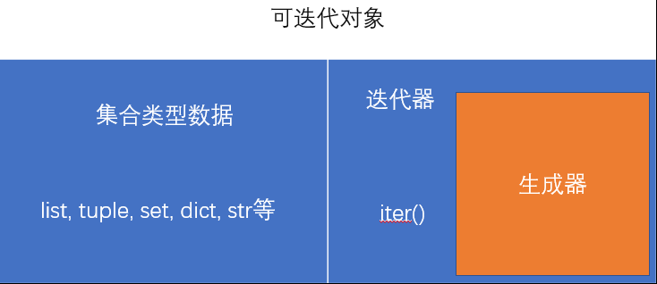

 - [1. 杂](#杂)  
   - [1.1. 正则](#正则)   
   - [1.2. 文件](#文件) 
   - [1.3. 序列化](#序列化) 
     - [1.3.1. json模块](#json模块)
     - [1.3.2. pickle模块](#pickle模块)
   - [1.4. 异常处理](#异常处理)
   - [1.5. 模块包](#模块包)
     - [1.5.1. 模块(module)](#模块module)
     - [1.5.2. 包(package)](#包package)
     - [1.5.3. 标准库](#标准库)
   - [1.6. 测试](#测试)
- [2. 可迭代对象(iterable)](#可迭代对象iterable)  
  - [2.1. 迭代器](#迭代器)
  - [2.2. 生成器(generator)](#生成器generator) 
  - [2.3. 推导式](#推导式)
- [3. 垃圾回收机制(GarbageCollect)](#垃圾回收机制garbagecollect)  
  - [3.1. 引用计数](#引用计数)  
  - [3.2. 分代回收](#分代回收)  
- [4. 进程与线程](#进程与线程)  
  - [4.1. 多进程](#多进程)
  - [4.2. 多线程](#多线程)
- [5. 网络编程](#网络编程)  
  - [5.1. UDP与TCP](#UDP与TCP)
  - [5.2. 三次握手与四次挥手](#三次握手与四次挥手)
  - [5.3. socket编程](#socket编程)


# 杂
## 正则
## 文件
文件操作是指通过代码对磁盘中的文件进行各种操作(读写) , 也称作 I/O(input/output)
- 读取一个文件的内容:
  1. 打开文件
  2. 操作文件(读/写)
  3. 关闭文件
   
- 打开文件
  - 使用open()根据文件的路径 , 打开指定文件
    - 写路径的时候 , 默认的是相对路径 
    - linux使用/作为路径分隔符 , window系统使用\作为分隔符 , 直接复制window系统的路径会导致出错  , 在字符串前加r表示\不再被当作转义符 , 就可以使用
  - 打开文件时 , 使用的编码并不是utf-8 , 而是文件默认的编码 , 所以在处理中文会乱码 , 可以在open中使用encoding来指定文件的编码
    ```py
    file_obj = open('algorithm\README.md',encoding='utf-8')
    ```
  - 在默认情况下 , open打开一个文件 , 这个文件是只读的 , 如果要修改文件要要通过第二个mode参数来指定打开方式
  
    - b 以二进制文件形式打开文件, 一般读取图片, 视频 , 音频 , 富文本文件时, 使用的rb或wb, 以二进制形式读取 , 读取的单位是字节
  
-  操作文件(读/写)
   -  read()用来读取文件的内容 , 如果直接使用read()会读取文件中所有的内容
      - 可以在read()中指定读取的长度 , 指定字节(符)的数据
      - 返回值是读取到的内容 , 如果没有读取到内容 , 返回一个空串
   - readline() 每次读取一行数据
   - readlines() 读取整个文件 , 返回的是一个列表 , 列表中的每一个元素都是一行数据
   - 打开的文件对象file_obj , 本身就是一个可迭代对象 , 可以通过 for-in 来读取文本数据
        ```py
        for line in file_obj:
            print(line)
        ```
    - write()  用于向文件写入内容 , 返回写入内容的长度
    - 当我们操作文件时 , 会有一个指针 ,我们读取或写入文件的时候 ,  会从指针所在位置开始读取或写入
      - tell() 方法可以获取指针当前的位置
      - seek() 修改指针到指定的位置 
        -  当读取或修改二进制文件时 , seek可以设置第二个参数 , 表示指针计算的相对位置
  		- 第二个参数的值 :
            0  默认值 , 指针位置相对于起始位置开始计算
            1 指针位置根据当前位置来计算
            2  指针位置从末尾开始计算

- 关闭文件
  - close() 关闭文件
  - 一般使用with语句, 自动关闭文件
    ```py
    with open(r'algorithm\README.md','r+',encoding='utf-8') as file_obj:
        for line in file_obj.read():
            print(line)
        file_obj.write('哈哈哈')
    ``` 
## 序列化
### json模块
- JSON(JavaScript Object Notation) 是一种轻量级的数据交换格式 , 在python中可以使用json模块将python中的数据转换为json
- 序列化
  - dumps()   将python对象转换为json格式
  - dump()   将python对象转换成json格式并存入文件
- 反序列化
  - loads()   将json数据转换成python对象
  - load()    读取文件中的json数据并将之转换成对象


### pickle模块
- pickle.dump(obj , file) 序列化的方法
  该方法用于将一个对象储存到文件中
  - 参数:
    - obj 要写入文件的对象
    - file 要写入的文件
- pickle.load(file)  反序列化的方法
  该方法用于从一个文件将对象加载出来
  - 参数:
    - file 文件对象
  - 返回值:
    - 返回从文件中加载到的对象
  

## 异常处理
当程序执行过程中出现异常 , 而又没有及时处理 , 会导致程序立即终止
- 处理异常
  ```py
    try:
	    pass    #可能出现异常的代码
	except Exception as e:
	    pass    #出现异常之后的处理方式,通过e获取捕获到的异常
	else:
	    pass    #else中的代码块 , 没有异常的时候执行
	finally:
        pass    # 不论有没有异常 , 都会执行的代码块(主要是一些释放资源的代码)
  ```
  - except后可以跟着一个异常类或一个由异常类组成的元组 , 此时except只会对响应的异常进行处理
  - 可以写多个except子句 , 用以分别处理不同的异
  - except Exception 捕获所有异常
    *Exception 所有异常的父类*
- 异常的传递
  - 异常的传递 , 一般称为抛异常(抛的是异常对象)
    当函数中出现异常时 , 如果在函数中对异常进行了处理 , 则异常不再向上传递 , 如果函数未对异常进行处理 , 则异常会向上传递至调用处 , 以此类推 , 直至传递到全局作用域 , 若还未对异常进行处理则程序结

  - 如果捕获到在该处无法处理或不适合在该处处理的异常 , 可以通过raise将异常抛至上一级
    当我们对某些数据有要求时(比如用户传递了不合法的参数) , 可以选择raise Exception抛出一个异常 , 让后续的代码必须处理这个异常
- 自定义异常类
  通过继承Exception , 定义的类就会成为一个异常类
  ```py
  class MyException(Exception):
    def __init__(self):
        self.mes = '我定义的异常'

    def __str__(self):
        return 'lalala'

    try:
        raise MyException()
    except Exception as e:
        print(e)    #lalala
        print(e.mes)    #我定义的异常
  ```

## 模块包
### 模块(module)
在编程时 , 模块化就是将一个完整的程序 , 分解成一个一个小的模块 , 一个大的程序 , 都是由一些小模块构成的 , 通过模块化 , 可以使代码很方便的复用

一个py文件就是一个模块 , 文件名就是模块名(主模块除外, 主模块的名字为__main__) , 模块的名字必须符合标识符的规范

- 引入模块
  使用import来引入模块
  - import 模块名
    - 引入模块之后 , 全局作用域中会多出一个全局变量 , 变量名就是模块的名字 , 代表我们所引入的模块
    - 可以通过 模块名.属性 的方式来访问模块中的变量和函数
    - import 模块名1 , 模块名2 
      可以同时引入多个模块 , 多个模块之间使用 , 隔开 (不推荐使用)
  - from 模块名 import xxx
    - 从指定模块中引入指定对象 , 此时只会引入所指定的对象 , 而且会将我们引入的内容设置为全局变量
    - 此时可以直接用 xxx 来访问所引入的内容
    - from 模块名 import xxx , yyyy
      从模块中引入多个对象
    - from 模块名 import *
      -  引入模块中的所有属性 , 并将其设置为全局变量(慎用 , 污染全局作用域)
      -  不会引入模块中 _变量名 的对象
   -  import 模块名 as xxx
      通过as使用别名来引入模块或对象 , 模块名过长或避免重名

- 在引入模块时 , 项目的根目录会自动创建 __pycache __ 文件夹
  
  文件夹中存放的是python模块的缓存文件(python的字节码文件) , 是python解释器对模块进行编译以后产生的字节码

  下次调用该模块时 , 不需要重新编译 , 而是直接从缓存中加载
  
- 同一个模块 , 在程序中只能被引入一次 ,		如果多次重复引入一个模块 , 后面的引入都是获取第一次的的值

### 包(package)
  包可以将多个小模块 , 整合为一个大模块 , 实际上就是一个文件夹
  - 文件夹中至少包含一个文件 __init __.py(包的主模块)
  - 引入包时 , 默认引入主模块
  - 文件夹的名字就是包名 , 必须符合标识符规范
  - 引入包时 , 只会引入主模块 , 子模块需要单独引入
    - from 包名 import 模块名  引入包中的子模块
    - from 包名.模块名 import fn  引入包中子模块中的函数
  
### 标准库
- sys模块 
与python解释器交互
  - sys.argv
    返回一个列表 , 列表中保存着命令行的参数
  - sys.modules
    返回当前程序所有已加载的模块
  - sys.path
    path中保存的是一个个路径 , 当我们引入模块时 , 解析器会依次去path中的路径寻找  
    如果我们希望解析器去指定路径加载模块 , 可以将路径添加到path中
  - sys.platform
    获取当前python运行的操作系统
  - sys.exit()
    用来立即结束程序

- os模块
和操作系统进行交互
  - os.listdir(path='.')
    该方法用来显示当前目录下所有文件(夹) , 返回存放文件(夹)名字的列表
    参数 :
		path来指定要查看的目录
        . 表示当前目录
  - os.getcwd()
    获取当前所在文件夹
  - os.chdir()
    改变当前所在目录
  - os.mkdir(path)
    创建一个目录
  - os.makedirs(path)
    递归的创建目录
  - os.rmdir(path)
    删除一个空目录
  - os.removedirs(name)
    删除一个路径中所有的空目录
  - os.remove(path)
    删除一个文件
  - os.rename(src , dst)
    对一个文件继续重命名 , 也可以通过在参数dst中改变路径位置来实现剪切的功能

- functools模块
  - @functools.lru_cache()装饰器
    使用该装饰器 , 可以自动对程序执行的结果进行缓存 ,
    如果函数已经进行过调用 , 则直接从缓存中加载数据 , 无需重新计算
  - @functools.wraps(func)
    使用该装饰器来指定函数的文档字符串
  - functools.partial
    可以用来对一个函数进行包装 ,对函数的参数进行指定,从第一个位置参数开始, 然后返回一个新函数 , 调用时 ,传递剩余参数就行
  - functools.reduce
    用来将一系列值 归约成单个值(高阶函数)

- 时间相关常用
  - time.strftime 格式化输出时间
  - datetime.now 返回现在的时间
  - datetime.timedelta 设置时间间隔
- pprint  格式化输出
- random  随机数

## 测试

# 可迭代对象(iterable)
迭代是访问集合元素的⼀种⽅式 , 所有可用迭代(即遍历)方式访问的对象都是可迭代对象



- 可迭代对象的本质
可迭代对象通过__iter __⽅法向我们提供⼀个迭代器，我们在迭代⼀个可迭代对象的时候，实际上就是通过iter()来获取一个可迭代对象的迭代器，然后通过这个迭代器来依次读取对象中的每⼀个数据。那么也就是说，⼀个具备了__iter __⽅法的对象，就是⼀个可迭代对象。

- object.__iter __ (self) 
  当一个对象拥有 __iter __ 方法时就是可迭代对象
  当我们对一个对象调用iter()时 , 实际上是调用一个对象的 __iter __ , 返回一个迭代器

## 迭代器
- 迭代器用来遍历数据
可以使用next()函数来读取迭代器的数据 , 该函数每调用一次 , 都会返回迭代器的下一个数据 , 直到没有数据时 , 抛出StopIteration错误

- 迭代器实际上储存的是一个数据流 , 也就是一个算法 , 每次调用时才会计算下个数据 , 所以迭代器每次只能读取一个数据 , 也只能读取一次
  
  
- object.__next __(self)
迭代器都含有一个__next__方法 , 当我们通过next()来读取数据时 , 实际上是调用的是next特殊方法

## 生成器(generator)
包含yield关键字的函数 

生成器函数在调用时 , 不是立即执行, 而是返回一个生成器对象 , 函数在对生成器进行遍历时才会执行

- 当遍历生成器时 , 函数开始执行到yield位置 , 并将yield后的值作为返回值返回再次遍历生成器 , 会接着上次执行的位置继续向下执行 , 依然执行到yield出停止 , 如果执行之后没有下一个yield , 会抛出StopIteration

可以使用变量来接收 yield 语句的返回值 , 默认总返回None
- 生成器中有一个send()方法 , 可以在触发生成器的同时 , 向生成器传递yield的返回值 (可以使用该方法向生成器中传递信息)


## 推导式
通过推导式 , 可以根据一个已有的可迭代对象 ,生成一个新的对象
- 列表推导式
[ expression for item in iterable if condition ]
    ```py
    lst = [i for i in range(15) if i%2 == 0]
   print(type(lst),lst) #<class 'list'> [0, 2, 4, 6, 8, 10, 12, 14]
    ```
- 生成器推导式
( expression for item in iterable if condition )
    ```py
    gen = (i for i in range(15) if i <= 5)
    print(type(gen),gen)    #<class 'generator'> <generator object <genexpr> at 0x00000243687E1F68>
    ```

- 字典推导式
  { key_expression : value_expression for expression in iterable }
  ```py
    dic = {i:j for i,j in globals().items()}
    print(type(dic))    #<class 'dict'>
  ```

# 垃圾回收机制(GarbageCollect)
程序在运行过程中会产生大量的垃圾 , 这些垃圾会长期占用内存 , 导致程序的运行速度变慢 . 所以在python中为我们提供了一种机制 , 可以自动对程序中的垃圾进行回收--> Garbage collect 垃圾回收机制.

- 所谓的垃圾对象就是没有任何变量或对象对其进行引用的对象
- 将不需要继续使用的变量置空 , python便会对其进行回收
- python的垃圾回收机制 , 引用计数为主 , 分代回收为辅

## 引用计数
python中为每一个对象记录引用的数量 , 当引用计数为0时 , 此时对象会变成垃圾立即回收
- 引用计数机制会一直运行 , 确保引用归0的对象被立即回收
- sys.getrefcount()  获取一个对象的引用计数
  该方法本身就对对象进行了引用 , 通过该方法获取的引用计数会比实际引用数量多 1 
- 无法解决循环引用问题

## 分代回收
通过分代回收来解决循环引用问题
- python将所有对象分成了三代 ,  0代 , 1代 , 2代 , 每代中使用一个链表来储存对象 
  - 0代链表存储的都是刚刚创建的对象 , 垃圾回收最频繁
  - 1代链表存放经历过一次垃圾回收的对象
  - 2代链表存放的是经历过两次以上垃圾回收的对象
  
- 回收流程
  先从0代链表中找到一个被变量引用的对象 , 将该对象作为根对象(root) ,然后找到根对象所引用的所有对象 , 这些对象升级到1代链表. 然后回到0代链表中继续寻找根对象 , 以此类推 , 直到无法找到根对象. 然后统一对0代链表中的对象进行引用 -1 ,如果引用变为0 ,则将其回收

- gc.get_threshshold()  获取分代回收的设置信息
返回一个元组 , 元组有三个元素 , 分别对应三代链表 (700,10,10)
    | | |
    | --- |----------------------------------------|
    | 700 | 当0代链表中超过700个对象时 , 自动进行分代回收 |
    | 10 | 当0代链表回收10次后 , 对0代和1代进行回收 |
    | 10 | 当1代链表回收10次后 , 对所有链表进行回收 |

- gc.disable()  gc.enable()  关闭启用垃圾回收
  
# 进程与线程
进程就是一个执行中的程序 , 进程保存着程序执行过程所有的代码和数据 , 在进程中可能会同时干多件事情 , 需要同时运行多个'子程序' , 这些子程序就是线程 , 在进程中负责运算的是线程 , 所以进程也称为线程的容器

线程是计算机最小的执行单元，进程由至少一个线程组成, 同一进程中的多条线程将共享该进程中的全部系统资源。

如何调度进程和线程，完全由操作系统决定，程序自己不能决定什么时候执行，执行多长时间。(*cpu时间片的快速切换*)

## 多进程
一个cpu内核同时只能执行一个进程 , CPU会在多个进程之间快速切换，以达到多个程序并行执行的效果。

在linux系统下,python提供os.fork()模块来实现多进程,而在windows系统下使用,multiprocessing模块来实现多进程

- Process
  用来创建一个进程对象 
```py
import os
from multiprocessing import Process

def fn():
    #os.getpid 获得当前进程的id
    print('子进程',os.getpid()) #子进程 5408


if __name__ == "__main__":
    print('父进程',os.getpid()) #父进程 18664
    p = Process(target=fn)
    p.start()
    p.join()

```
参数:
  - target 在进程中执行的函数  
  - args , kwargs 指定函数所需要的位置参数 , 关键字参数
  - daemon  用来设置进程是否是一个守护进程 , 默认值为False , 如果是True ,则主进程结束 , 子进程也会一起结束
  
  方法:
  - run( )  可以立即将立即执行函数中的代码 , 但不会启动多进程
  - start( )  启动多进程 , 并调用run()执行代码
  - join( )  将子进程加入主进程 , 子进程不执行完 , 主进程不会继续执行

  也可以通过类来实现多进程任务调用
  只需要创建一个类 , 使其继承Process , 并且实现其中的run方法
  ```py
  class Son(Process):
    def run(self):
         print('子进程',os.getpid()) #子进程 18368

    if __name__ == "__main__":
        print('父进程',os.getpid()) #父进程 18812
        son =Son()
        son.start()
        son.join()
```
- 进程间通信
  进程与进程之间的运行是完全独立的 , 在一个进程中无法访问到其他进程中的变量 , 即使是全局变量或者是参数 , 都会在进程中创建一个副本 . 所以 , 在某个进程中做了任何修改 , 都不会影响到其他进程.

  multiprocessing模块提供了一个队列对象 , 通过该对象可以在进程间共享数据

  Queue 用来创建一个队列的实例
  创建队列时 , 可以在类中指定一个队列的大小 , 队列最多容纳的数据数量
  方法:
    - put() 用于向队列中储存数据
    - get()  用于获取队列中的数据 , 会获取队列中的第一个数据(先进先出)
      使用get()时 , 如果队列中没有数据 , 不会报错 , 而是一直等待 ,它会阻塞程序的执行 , 直到有数据可以取出
    - get_nowait() 该方法也可以获取 , 如果没有则会报错queue.Empty
    - qsize() 返回队列的大小
    - empty() 队列是否为空
    - full() 队列是否已满
    - close() 关闭队列 , 停止向队列中添加数据

    ```py
    import os
    from multiprocessing import Process, Queue

    #生成者消费者模型
    def producer(q):
        print(f'我是生产者{os.getpid()}')
        for i in range(3):
            q.put(i)
        print('-----------------')

    def consumer(q):
        print(f'我是消费者{os.getpid()}')
        while not q.empty():
            i = q.get()
            print(i)
        print('-----------------')

    if __name__ == "__main__":
        print('父进程',os.getpid())
        print('-----------------')
        q = Queue(3)
        pro = Process(target=producer, args=(q,))
        con = Process(target=consumer, args=(q,))
        pro.start()
        con.start()
        pro.join()

        #   父进程 19244
        #   -----------------
        #   我是生产者14908
        #   -----------------
        #   我是消费者18320
        #   0
        #   1
        #   2
        #   ----------------
    ```

- 进程池(Poll)
  进程池中可以储存多个可复用的进程对象 , 在需要的直接使用 ,无需重新创建新的进程 , 避免造成系统资源的浪费.

  Pool()  用来创建一个进程池 , 创建进程池时 , 可以指定池里进程的数量
  方法:
    - apply(func[, args [, kwargs]]) 
      向进程池中添加函数 , 同步方法 , 会立即执行 , 并不会启用多进程
    - apply_async(func[, args [, kwargs]]) 
      向继承池中添加函数 , 异步方法 , 将需要执行的函数添加到进程池中 ,   等到指令才会执行 ,进程池会自动分配进程按顺序执行
    - close() 关闭进程池
    - terminate()  终止进程池的所有进程
    - join() 将子进程加入到主进程
  
    在进程池中通过Manager()类提供的对象来实现进程间的通信
    方法:
    - Queue()  返回一个队列对象
    - dict()  返回一个字典对象
    - list() 返回一个列表对象
    ```py
    import os
    from multiprocessing import Process, Queue, Pool

    def slaver(i):
        print('我是',os.getpid(),'------',i)
        time.sleep(1)
        

    if __name__ == "__main__":
        print('父进程',os.getpid())
        print('-----------------')
        pool = Pool(3)
        for i in range(4):
            pool.apply_async(slaver,args=(i,))
        pool.close()
        pool.join()
        #   父进程 15584
        #   -----------------
        #   我是 18560 ------ 0
        #   我是 13844 ------ 1
        #   我是 11596 ------ 2
        #   我是 18560 ------ 3
    
    ```
## 多线程
多线程是在单个进程中创建多个线程的方式来实现多任务
python中通过threading模块实现多线程

- Thread() 用来创建一个线程对象
  参数:
    - target() 目标函数
    - args 位置参数元组
    - kwargs 关键字参数元组
    - daemon 是否等待子线程结束
    - name 线程名字
  方法:
    - run() 立即执行目标函数 , 不会进入线程
    - start() 开始线程 , 只调用一次 , 内部调用run()
    - join() 子线程不执行完 , 主线程不会继续执行
    - name() 获取线程的名字
    - daemon() 父线程是否等待子线程

同一进程中的多个线程 , 同时访问并修改同一个变量时 , 将有可能导致线程安全问题(并发) , 可以通过线程所来解决

- Lock() 用来创建一个表示线程锁的对象
  当我们加锁时 , 如果没有加锁 , 可以正常加锁 , 如果已经上锁 , 则会等待锁被释放 , 才能加锁继续向下执行
    - acquire()  加锁
    - release()  解锁

死锁 , 指两个或以上的进程(线程)在执行过程中 , 由于竞争资源或者由于彼此通信而造成的一个阻塞现象 , 若无外力作用 , 它们都将无法继续下去 . 这种永远在互相等待的进程 , 称为死锁进程. 
- 所以在多线程程序中要使用try...finally...来释放锁
  
local对象用于在线程中储存数据
每个线程只能访问自己储存在local中的数据 , 而无法访问其他线程的数据

```py
from threading import Thread

def lst_add(lst):
    for i in range(1000000):
        lst.append(i)
    print(len(lst))

def lst_pop(lst):
    for i in range(1000000):
        lst.pop()     
    print(len(lst))
if __name__ == "__main__":
    lst = []
    t_add = Thread(target=lst_add,args=(lst,)) 
    t_pop = Thread(target=lst_pop,args=(lst,))
    t_add.start()
    t_pop.start()
    t_add.join()
    t_pop.join()

    print(lst)
    #282731 由于线程争抢导致t_add还没添加完,就被pop除去了
    #0
    #[]
```
```py
from threading import Thread,Lock

def lst_add(lst):
    lock.acquire()
    try:
        for i in range(1000000):
            lst.append(i)
    finally:
        lock.release()
    print(len(lst))

def lst_pop(lst):
    lock.acquire()
    try:
        for i in range(1000000):
            lst.pop() 
    finally:
        lock.release()    
    print(len(lst))

if __name__ == "__main__":
    lst = []
    lock = Lock()
    t_add = Thread(target=lst_add,args=(lst,)) 
    t_pop = Thread(target=lst_pop,args=(lst,))
    t_add.start()
    t_pop.start()
    t_add.join()
    t_pop.join()

    print(lst)

# 加锁后解决线程争抢问题
# 0
# []

```

在python中 , 由于GIL的存在 , 在同一时刻只能有单个线程读取进程中的系统资源 , 所以无法实现真正的多线程


## 协程
协程看上去也是子程序，但执行过程中，在子程序内部可中断，然后转而执行别的子程序，在适当的时候再返回来接着执行。子程序就是协程的一种特例.

协程最大的优势就是极高的执行效率。因为子程序切换不是线程切换，而是由程序自身控制，因此，没有线程切换的开销，和多线程比，线程数量越多，协程的性能优势就越明显。
第二大优势就是不需要多线程的锁机制，因为只有一个线程，也不存在同时写变量冲突，在协程中控制共享资源不加锁，只需要判断状态就好了，所以执行效率比多线程高很多。

因为协程是一个线程执行，那怎么利用多核CPU呢？最简单的方法是多进程+协程，既充分利用多核，又充分发挥协程的高效率，可获得极高的性能。
```py
    #协程实现生产者消费者
    def producer(c):
        c.send(None)
        for n in range(1,4):
            print(f'生产者~~~{n}')
            mes = c.send(n)
            print(f'消费者返回了{mes}')
            print('-----------------')
        c.close()
        
    def consumer():
        mes = ''
        while 1 :
            n = yield mes
            if not n:
                return
            print(f'消费者~~~~{n}')
            mes = '200 ok'
            
    c = consumer()
    producer(c)
    #   生产者~~~1
    #   消费者~~~~1
    #   消费者返回了200 ok
    #   -----------------
    #   生产者~~~2
    #   消费者~~~~2
    #   消费者返回了200 ok
    #   -----------------
    #   生产者~~~3
    #   消费者~~~~3
    #   消费者返回了200 ok
    #   -----------------
```

- 消息模型
    消息模型是如何解决同步IO必须等待IO操作这一问题的呢？当遇到IO操作时，代码只负责发出IO请求，不等待IO结果，然后直接结束本轮消息处理，进入下一轮消息处理过程。当IO操作完成后，将收到一条“IO完成”的消息，处理该消息时就可以直接获取IO操作结果。

    在“发出IO请求”到收到“IO完成”的这段时间里，同步IO模型下，主线程只能挂起，但异步IO模型下，主线程并没有休息，而是在消息循环中继续处理其他消息。这样，在异步IO模型下，一个线程就可以同时处理多个IO请求，并且没有切换线程的操作。对于大多数IO密集型的应用程序，使用异步IO将大大提升系统的多任务处理能力。

- epoll
  

# 网络编程
## UDP与TCP
- 用户数据报协议（英语：User Datagram Protocol，缩写为UDP），又称用户数据报文协议，是一个简单的面向数据报的传输层协议。
  - UDP只提供数据的不可靠传递，它一旦把应用程序发给网络层的数据发送出去，就不保留数据备份
  - 特点
    -   面向数据报
    -   传输速度快
    -   支持广播
    -   不可靠
  - 应用场景
    - 发送小型信息
    - 不要求数据完整(视频 , 游戏等)
    - 广播
    - DNS,TFTP,DHCP

- 传输控制协议（英语：Transmission Control Protocol，缩写为TCP）是一种面向连接的、可靠的、基于字节流的传输层通信协议。
  - TCP使得应用程序可以使用连续的数据流进行相互通信。除非由于网络原因导致连接中断或冻结，TCP都能保证数据流完好无缺地传送至接收方，而不会发生丢包、重包或是乱序的问题 
  - 特点 :
    - 面向连接
    - 传输速度慢
    - 可靠
  - 应用场景
    - 大部分情况
    - HTTP,SMTP,FTP

## 三次握手与四次挥手
三次握手，TCP协议中创建连接的的机制，四次挥手是断开连接的一种机制. 确保数据完整的传输
- 三次握手
  1. 客户端首先发送一个带SYN标志的数据包给服务器(申请连接)
  2. 服务器收到后，回传一个带有SYN/ACK标志的数据包以示传达确认信息(同意连接)
  3. 最后客户端在传回一个带ACK标志的数据包，代表握手结束
- 四次挥手
  1. 客户端发送FIN，通知服务器，没有数据需要发送了
  2. 服务器收到FIN，返回一个ACK通知客户端，收到但是服务器可能还有后续工作
  3. 服务器返回一个FIN给客户端，告诉客户端数据发送完毕，可以断开
  4. 客户端发送ACK给服务器，确认关闭

## socket编程
套接字(socket)是一个信息通道 , 通过其来连接不同的计算机.

- socket.socket(family=AF_INET , type=SOCK_STREAM )
  创建一个sokect
  参数:
    - family 地址协议 , 指定IP协议的版本
      默认值socket.AF_INET 表示使用IPv4协议 , socket.AF_INET6 表示使用IPv6协议
    - type  套接字类型 , 指定请求协议
       默认值socket.SOCK_STREAM , 表示使用TCP协议
        socket.SOCK_DGRAM , 表示使用UDP协议 (*UDP协议支持局域网内的广播 , 广播地址默认为 X.X.X.255*)
    
  方法:
    - bind((host , port)) 为socket绑定ip地址和端口号 ,传入一个元组 
      host 主机名(IP地址)  字符串 (使用' '空串 , 表示本机)
      port 端口号 数字
    - recv(int)  用来接收数据 ,
			需要传入一个整数作为参数 , 指定接收数据的最大的大小 , 返回接收的数据
    - recvfrom(int) 同上 , 返回接收的数据和地址的元组对象
    - sendto(data , (host , port))  向指定地址发送数据
    - connect(address)  和指定地址建立连接
  
  ```py
	#使用UDP创建简单的聊天室模型
	#服务器端
	import socket
	from threading import Thread
	import json
	
	Users = {}
	Addrs = []
	def recv_mes(soc):
	    while True:
	        data,addr = soc.recvfrom(1204)
	        data = data.decode("utf-8")
	        if data.startswith("username@"):
	            Users[addr] = data.lstrip('username@')
	            Addrs.append(addr)
	            mes = f"欢迎{Users[addr]}加入聊天室"
	        else:    
	            mes = Users[addr] + ':' + data
	            
	        for ads in Addrs:
	             soc.sendto(mes.encode('utf-8'),ads)
	
	if __name__ == "__main__":
	    soc = socket.socket(family=socket.AF_INET , type=socket.SOCK_DGRAM )
	    soc.bind(('',6666))
	    recv_mes(soc)
  #客户端
	import socket
	from threading import Thread

	sever_address = ('192.168.0.101',6666)
	
	
	def recv_mes():
	    '''客户端接收消息'''
	    while 1:
	        data,addr = soc.recvfrom(1204)
	        if addr == sever_address:
	            print(data.decode('utf-8'))
	
	def send_mes():
	    '''客户端消息'''
	    while 1:
	        data = input('')
	        soc.sendto(data.encode('utf-8'),sever_address)
	
	if __name__ == "__main__":
	    soc = socket.socket(family=socket.AF_INET , type=socket.SOCK_DGRAM )
	    port = input('请输入端口:')
	    soc.bind(('',int(port)))
	    user_name = {}
	    #向服务器发送用户名
	    username = 'username@' + input('请输入用户名:')
	    print(1)
	    soc.sendto(username.encode('utf-8'),sever_address)
	    #启动双线程,进行收发消息
	    recv_thread = Thread(target=recv_mes)
	    send_thread = Thread(target=send_mes)
	    recv_thread.start()
	    send_thread.start()
	    recv_thread.join()
  ```

- TCP编程
  - sock = socket.socket()
    默认创建TCP服务器
  - sock.listen(int)
    设置连接的数量 , int表示等待连接的队列中最大数量
  - conn , addr = sock.accept()
    服务器等待连接的创建 , 返回 (连接, 地址) 的元组
  - conn.recv(int) 
    连接接收消息
  - conn.send()
    向客户端返回消息
  - conn.close()
    关闭连接 
```py
# 生产者消费者模型的tcp服务器
import socket
from threading import Thread
from queue import Queue

sock = socket.socket()
sock.bind(('',6666))
sock.listen(3)
q = Queue()

def wait_conn():
  #当有链接过来时 , 将其加入队列q
    while 1:
        conn,addr = sock.accept()
        q.put(conn)

def deal_conn(conn):
    while 1:
        data = conn.recv(1024)
        if not data:
            conn.close()
            break
        print(data.decode('utf-8'))
        conn.send('Nice to meet to you too!'.encode('utf-8'))

def mk_thread():
  #当q队列中有连接进来是,新建一个线程去处理连接
    while 1:
        conn = q.get()
        if conn:
            deal_thread = Thread(target=deal_conn,args=(conn,))
            deal_thread.start()


if __name__ == "__main__":
    wait_thread = Thread(target=wait_conn)
    new_thread = Thread(target=mk_thread)
    wait_thread.start()
    new_thread.start()
    wait_thread.join()
    new_thread.join()
```
